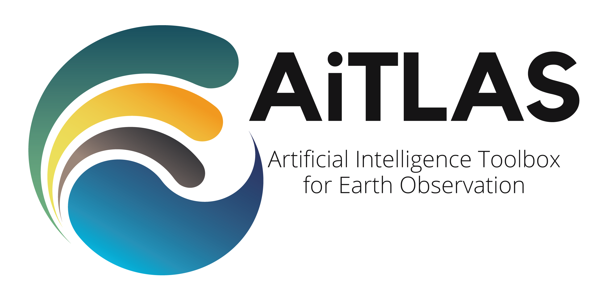

[](https://www.repostatus.org/#active) [](https://www.python.org/downloads/release/python-3120/) [](https://github.com/biasvariancelabs/aitlas/blob/master/LICENSE) [](https://aitlas.readthedocs.io/en/latest/?badge=latest)




The AiTLAS toolbox (Artificial Intelligence Toolbox for Earth Observation) includes state-of-the-art machine learning methods for exploratory and predictive analysis of satellite imagery as well as repository of AI-ready Earth Observation (EO) datasets. It can be easily applied for a variety of Earth Observation tasks, such as land use and cover classification, crop type prediction, localization of specific objects (semantic segmentation), etc. The main goal of AiTLAS is to facilitate better usability and adoption of novel AI methods (and models) by EO experts, while offering easy access and standardized format of EO datasets to AI experts which allows benchmarking of various existing and novel AI methods tailored for EO data.

# 📢 Latest updates
🔥🔥🔥 AiTLAS 2.0.0 is out now! [2026-04-30] 🔥🔥🔥

## 🛰️ New foundation models & adapters
Added comprehensive support for the following foundation models:
- AnySat, CACo, Copernicus-FM, CROMA, DOFA (v2)
- Galileo, GASSL, Panopticon, Presto, Prithvi (v2)
- SatMAE, SatMAE++, Scale-MAE, SeCo, TerraFM, TerraMind

## 🧠 New model architectures
- **Change detection**: Added BIT, CGNet, ChangeFormer V6, ChangeMamba, ChangeVIT, CSSM, HRNet SiamConc, SiamCRNN, STANet, TinyCD, and U-Net SiamConc.
- **Object detection**: ATSS, CenterNet, DETR, EfficientDet, NanoDet-Plus, and Sparse R-CNN.
- **Segmentation**: Added FPN, MaNet, PSPNet, SegFormer, UNet++, and UPerNet.

## 🛠️ Key improvements & features
- **New build system**: Complete migration to `uv` and `pyproject.toml` for faster, reproducible builds.
- **Modern infrastructure**: Switched to `ruff` for ultra-fast linting and formatting.
- **Foundation model architecture**: Implemented `CompositeModel`, allowing for dynamic building of backbones, adapters, necks, decoders and heads.
- **Training**: Added Automatic Mixed Precision (AMP), Early Stopping on NaN loss, and state preservation (LR scheduler/checkpoints) for restarts.
- **Adapters**: Implemented specific data-model adapters for foundation models, such as Terramind, AnySat, Galileo, and Panopticon.
- **Examples**: Overhauled Jupyter notebook examples for new foundation models and downstream tasks.

## ⚠️ Breaking changes
- Minimum Python version is now **3.12**.
- Removed `requirements.txt` in favor of `pyproject.toml` dependencies.
- Namespaced foundation model classes in `aitlas.models` to resolve implementation collisions.

# Getting started

AiTLAS Introduction https://youtu.be/-3Son1NhdDg

AiTLAS Software Architecture: https://youtu.be/cLfEZFQQiXc

AiTLAS in a nutshell: https://www.youtube.com/watch?v=lhDjiZg7RwU

AiTLAS examples:
- Land use classification with multi-class classification with AiTLAS: https://youtu.be/JcJXrMch0Rc
- Land use classification with multi-label classification: https://youtu.be/yzHkEMbDW7s
- Maya archeological sites segmentation: https://youtu.be/LBFY4pCfzOU
- Visualization of learning performance: https://youtu.be/wjMfstcWBSs

# Installation

AiTLAS requires Python 3.12+. While you can use standard `pip`, we highly recommend `uv` for significantly faster installations. This will automatically handle all dependencies defined in pyproject.toml. Here are the steps:

- Clone the AiTLAS repository
```bash
git clone https://github.com/biasvariancelabs/aitlas.git
```

- Go to the folder where you cloned the repo

- Install using `uv`
```bash
uv pip install .
```

- Or, for developers (editable mode)
```bash
uv pip install -e .
```

- Verify the installation
```bash
python -c "import aitlas; print(f'AiTLAS version: {aitlas.__version__}')"
```

- Running AiTLAS
```bash
python -m aitlas.run configs/example_config.json
```

---

**Note:** You will have to download the datasets from their respective source. You can find a link for each dataset in the respective dataset class in `aitlas/datasets/` or use the **AiTLAS Semantic Data Catalog**

---
# Citation
For attribution in academic contexts, please cite our work **'AiTLAS: Artificial Intelligence Toolbox for Earth Observation'** published in Remote Sensing (2023) [link](https://www.mdpi.com/2072-4292/15/9/2343) as

```
@article{aitlas2023,
AUTHOR = {Dimitrovski, Ivica and Kitanovski, Ivan and Panov, Panče and Kostovska, Ana and Simidjievski, Nikola and Kocev, Dragi},
TITLE = {AiTLAS: Artificial Intelligence Toolbox for Earth Observation},
JOURNAL = {Remote Sensing},
VOLUME = {15},
YEAR = {2023},
NUMBER = {9},
ARTICLE-NUMBER = {2343},
ISSN = {2072-4292},
DOI = {10.3390/rs15092343}
}
```
# The AiTLAS Ecosystem

## AiTLAS: Benchmark Arena

An open-source benchmark framework for evaluating state-of-the-art deep learning approaches for image classification in Earth Observation (EO). To this end, it presents a comprehensive comparative analysis of more than 500 models derived from ten different state-of-the-art architectures and compare them to a variety of multi-class and multi-label classification tasks from 22 datasets with different sizes and properties. In addition to models trained entirely on these datasets, it employs benchmark models trained in the context of transfer learning, leveraging pre-trained model variants, as it is typically performed in practice. All presented approaches are general and can be easily extended to many other remote sensing image classification tasks.To ensure reproducibility and facilitate better usability and further developments, all of the experimental resources including the trained models, model configurations and processing details of the datasets (with their corresponding splits used for training and evaluating the models) are available on this repository.

**repo**: [https://github.com/biasvariancelabs/aitlas-arena](https://github.com/biasvariancelabs/aitlas-arena)

**paper**: [Current Trends in Deep Learning for Earth Observation: An Open-source Benchmark Arena for Image Classification](https://www.sciencedirect.com/science/article/pii/S0924271623000205) , ISPRS Journal of Photogrammetry and Remote Sensing, Vol.197, pp 18-35


## Semantic Data Catalog of Earth Observation (EO) datasets (beta)

A novel semantic data catalog of numerous EO datasets, pertaining to various different EO and ML tasks. The catalog, that includes properties of different datasets and provides further details for their use, is available [here](https://eodata.bvlabs.ai/ai4eo)
